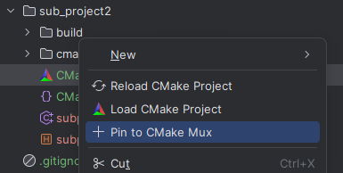
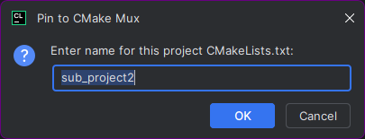
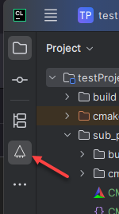
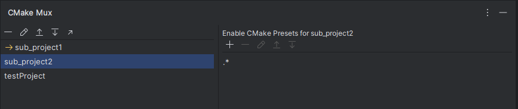
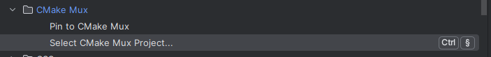

# CLion CMake Mux Plugin

## Overview

This plugin enables quick CMake project switching in CLion via:

- Project tool window context action for any CMakeLists.txt, “Pin to CMake Mux”
- New CMake mux panel to manage pinned projects
- Popup action to easily switch projects via keyboard shortcuts
- Automatic CMake preset enabling for selected projects

All this enables switching between multiple CMake projects more convenient compared to the standard CLion experience.

## Background

By default, CLion uses the `CMakeLists.txt` in your project root as the top-level CMake file. To switch, you can
right‑click another `CMakeLists.txt` and choose “Load CMake Project.” If you switch frequently, repeating this manual
step becomes tedious.

This plugin adds a shortlist of user-defined projects. Double‑click any item to load it (equivalent to “Load/Reload
CMake Project”).

Additionally, while CLion automatically imports any CMake presets it finds for a particular project location, they start
disabled. The plugin lets you define regular expressions per project shortcut to automatically enable matching presets
after switching.

## Details

When you right‑click any `CMakeLists.txt`, the plugin provides a “Pin to CMake Mux” in the context menu.

Adding a `CMakeLIsts.txt` to the mux requires a nickname:

The plugin also provides a panel where you can manage your pinned CMake projects.

The panel lists pinned projects and highlights the active one with a yellow arrow. Double‑click any project to load it
using CLion’s “Load CMake Project.” The “Enable CMake presets for <project>” panel lets you specify any number of
regular expressions; presets whose names match are enabled automatically.

The action “Select CMake Mux Project...” can be bound to a custom keyboard shortcut. Invoking it shows a popup with the
first nine pinned projects. Press a digit to load the corresponding project, or use the arrow keys and Enter.

> [!NOTE]
> The plugin has no additional settings settings panel. It simply extends the CLion UI to streamline
> multi‑project CMake workflows.

## Future

The plugin will receive updates as long as CLion/Jetbrains continue to support the APIs and hooks used by the plugin.
And if Jetbrains ever decides to add a similar features to CLion, this plugin will be obsolete. See
this [feature request](https://youtrack.jetbrains.com/issue/CPP-1537) for more details.
